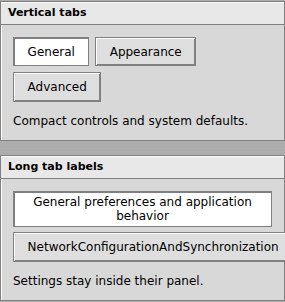
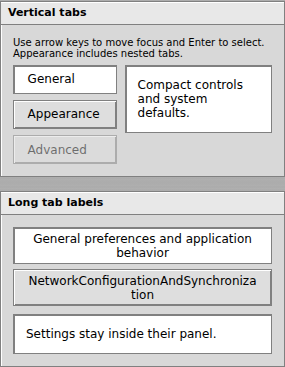
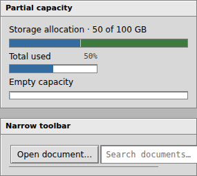
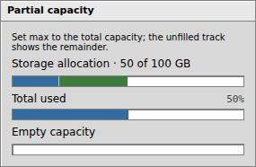
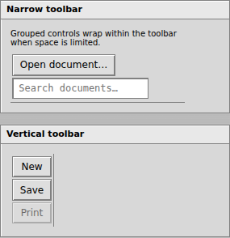

# Component rendering review and plan

## Visual analysis before implementation

Baseline: PR #32 at `9c671aca473e2b6e38ea03f2cd74177074fa750d`.
Reviewed rendered examples at 1280, 768, 390, and 320 pixels: buttons, fields,
selection controls, disclosures, sliders, progress, meters, content patterns, tabs,
overlays, tables, and windows. Compared the existing bevels, inset surfaces, typography,
and control density with the rendered WorkbenchOS interface.

Added docs fixtures to expose existing components in less-covered states before changing
component code. Captures and DOM measurements confirmed:

| Priority | Finding                                                          | Evidence                                                                                                                                                                                  | Planned change                                                                                                                                                  |
| -------- | ---------------------------------------------------------------- | ----------------------------------------------------------------------------------------------------------------------------------------------------------------------------------------- | --------------------------------------------------------------------------------------------------------------------------------------------------------------- |
| High     | SegmentedMeter misrepresents partial capacity                    | At 320px, segments occupy the entire 257px inner track for a 50/100 value. The adjacent Meter correctly shows half full. An empty segmented meter still has a 1px divider.                | Size segments against the resolved maximum and leave unused capacity visible. Suppress zero-value segments without changing the accessible numeric summary.     |
| High     | Tabs do not follow vertical orientation and long labels overflow | Vertical tabs share the same top coordinate and lay out horizontally. An unbroken label is 280px wide inside 259px of available content; the document grows to 324px at a 320px viewport. | Add orientation-specific layout, wrap long labels within their available width, and retain Base UI selection and keyboard handling.                             |
| Medium   | Tab content has no visible panel boundary                        | Active content appears directly on the surrounding gray canvas even though the docs describe an inset document panel.                                                                     | Add a modest inset panel using existing document, border, and bevel tokens; keep focus-visible treatment and hidden panels correct.                             |
| High     | Toolbar groups overflow narrow containers                        | A group containing Open document and Search has a 301px scroll width inside a 204–216px toolbar. The screenshot shows the input extending beyond the surface.                             | Let groups wrap and shrink within their toolbar. Let the input shrink when necessary while keeping normal control geometry. Respect vertical group orientation. |

The range and vertical Slider fixtures rendered correctly, including track dimensions and
range fill. Existing progress, input, checkbox, radio, switch, banner, loader, breadcrumb,
and window examples showed no new reason for a visual change in this pass.

The state review also confirmed that disabled tabs render with full opacity: Base UI sets
`data-disabled` and `aria-disabled`, while the stylesheet only targets native `:disabled`.
Extend the disabled and hover selectors to match the actual state attribute. Preserve the
existing ability to focus disabled tabs without activating them.

## Implementation and validation plan

1. Add focused geometry and interaction regressions for meter proportions, zero values,
   vertical tabs, long labels, toolbar containment, and keyboard operation. Confirm that
   the regressions fail on the baseline rendering.
2. Implement the smallest shared changes in SegmentedMeter, Tabs CSS, and Toolbar CSS.
   Keep public names, value semantics, palette, and existing control geometry.
3. Keep representative examples in their normal docs sections with brief usage guidance.
   Check related horizontal, vertical, disabled, selected, focused, and narrow states.
4. Review before/after captures at all four viewport widths. Exercise tab navigation,
   input focus, and overlay positioning. Check meter geometry against numeric values.
5. Run `npm run check`, the full browser suite, both builds, and `npm run pack:check`.
   Review the final diff and update PR #32 with the rendering findings and results.

## Self-review of the plan

- Meter widths must include borders in their allocated proportions; zero-value segments
  must not steal pixels. Preserve the behavior when max is omitted or smaller than the sum.
- Vertical tabs must remain usable in narrow parent containers as well as narrow viewports.
  Test nested tabs so parent orientation styles cannot accidentally restyle a child set.
- An inset panel must not override Base UI's hidden state or make inactive panels visible.
- Toolbar wrapping must preserve keyboard order and work without turning every toolbar
  input into a full-width field on desktop.
- Avoid changing global control rules: test adjacent controls and the existing window and
  overlay suite after the scoped CSS changes.

## Implemented result

- Segments use a percentage of the resolved maximum without flex growth. The divider
  is an inset shadow, so it no longer consumes capacity. At 320px, the 257px inner
  track renders the 20/100 and 30/100 segments at 51.39px and 77.09px; the remainder
  stays empty. Zero-value segments draw no fill or divider. Numeric ARIA values and
  the existing maximum normalization remain unchanged.
- Tabs now support vertical layout, wrap labels, show the documented inset surface,
  and distinguish disabled tabs. Direct-child orientation selectors preserve nested
  horizontal tabs. Arrow keys move focus, Enter activates, and disabled tabs remain
  focusable without becoming selected, matching the existing Base UI contract.
- Toolbar groups wrap within constrained containers and stack in vertical toolbars.
  Buttons and inputs stay inside the available width; arrow-key focus still reaches
  the input. The narrow fixture's scroll width now equals its 204–216px width.
- Added permanent docs examples for partial and empty capacity, vertical and nested
  tabs, long labels, narrow toolbars, and vertical toolbars. No public props or exports
  were added or removed.

## Before and after

These captures use a 320px viewport. The final docs add usage guidance and separate the
meter and toolbar examples; the component values and narrow-container cases are retained.

| Tabs before                                                                                                     | Tabs after                                                                                          |
| --------------------------------------------------------------------------------------------------------------- | --------------------------------------------------------------------------------------------------- |
|  |  |

| Meter and toolbar before                                                                                           | Meter after                                                         | Toolbar after                                                                             |
| ------------------------------------------------------------------------------------------------------------------ | ------------------------------------------------------------------- | ----------------------------------------------------------------------------------------- |
|  |  |  |

## Validation

- Reproduced incorrect meter proportions, tab layout/overflow, and toolbar containment
  before the source changes. Confirmed disabled-tab opacity separately during the state
  pass. Corrected test assumptions about Base UI manual tab activation and focusable
  disabled tabs rather than changing their interaction contract.
- Inspected before/after renders at 1280, 768, 390, and 320px, including existing adjacent
  controls and the added fixtures. The document has no horizontal overflow at any width.
  Checked nested tab selection, disabled activation, toolbar input entry and keyboard
  navigation. Geometry comparisons read related bounds in one frame to avoid smooth-scroll
  movement between measurements.
- `npm run check`: formatting, lint, typecheck, and all 54 unit tests pass.
- `npm run test:browser`: all 23 tests pass, including 12 new rendering/interaction
  regressions and the existing window, popup containment, and overlay page-shift checks.
- `npm run build`, `npm run build:docs`, and `npm run pack:check`: pass, including
  emitted declaration consumers, SSR imports, package budgets, and dry-run packaging.
- Browser validation used the temporary Chromium executable described in the TypeScript
  review; no browser dependency was added. Other browser engines were not exercised.
  npm emits the environment's existing unknown `http-proxy` configuration warning.
